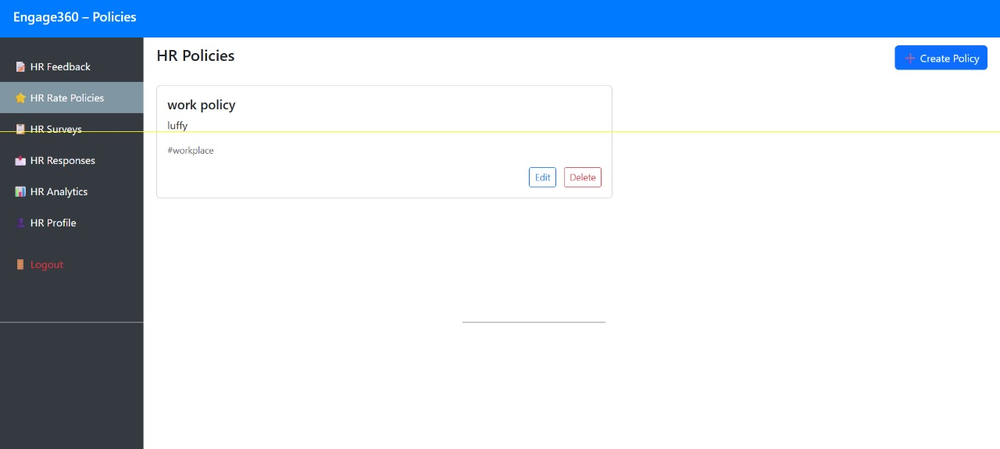

# Employee-Feedback-Portal
To develop a secure, interactive portal 'Engage360' that enables employees to submit feedback, rate policies, participate in surveys, view analytics, and receive HR responses. The portal should follow Agile methodology and use modern Java technologies from front-end to deployment.

## Table of Contents
- [Installation](#installation)
- [Usage](#usage)
- [Sprint Release](#sprint-release)
- [Features](#features)
- [Tech Stack](#tech-stack)
- [Folder Structure](#folder-structure)
- [Files](#files)
- [Demo](#demo)

---

## Installation
- git clone https://github.com/Sateesh-2416786/Employee-Feedback-Portal.git
- copy file path of loginPage.html
- open in your browser 

---

## Usage
- You can see, navigate through the different pages
- You can see login, singup pages.
- You can explore user pages, admin pages.

---

## Sprint Release
- Date: 18/06/2025
- Sprint 1 includes the following tasks
    - Create an Agile Jira board
    - Create responsive pages
    - Add JavaScript/jQuery validation
    - Set up a GitHub repository
    - Write a shell script that backs up
    - Prepare a checklist for UI

---

## Features
- Mobile-friendly layout using Bootstrap grid system. 
- Bootstrap 5 components (buttons, cards, navs).
- Navigation using jQuery show/hide or tabs (no SPA routing). 
- Show loading indicators on actions (e.g. submitting form).
- jQuery event handling for clicks, form submits, toggles.

Engage360 is a responsive and interactive web portal that allows employees to:
- Submit feedback
- Rate company policies
- Participate in surveys
- View HR responses
- View analytics (for HR)
- Manage policies and surveys (for HR)

---

## Tech Stack
- Frontend - HTML, CSS, jQuery
- Scripting - JavaScript, Unix
- Versioning - Git

---

## Folder Structure

├── doc/ # Documentation, checklist
├── emp\_feedback\_portal/ # All HTML files and assets
│ ├── loginPage.html
│ ├── employee.html
│ ├── feedback.html
│ ├── policies.html
│ ├── surveys.html
│ ├── surveyForm.html
│ ├── responses.html
│ ├── profile.html
│ ├── hr.html
│ ├── hr-feedbackform.html
│ ├── hr-policies.html
│ ├── hr-responses.html
│ ├── hr-surveys.html
│ ├── hr-surveyform.html
│ ├── hr-analytics.html
│ └── hr-profile.html

---

## Files

### Employee Panel HTMLs

| Page                       | Filename(s)                          | Features/Content |
|----------------------------|--------------------------------------|------------------|
| **Dashboard / Navigation** | `employee.html`                      | Sidebar navigation with links to Feedback, Policies, Surveys, Responses |
| **Submit Feedback**        | `employee.html` + `feedback.html`    | Input for title, description, anonymous checkbox, jQuery validation, success alert |
| **Rate Policies**          | `policies.html`                      | Lists all policies, user can rate each with stars/emoji, jQuery handles submission and UI |
| **Surveys**                | `surveys.html` + `surveyForm.html`   | List of surveys, form popup to take survey, stores response |
| **View Responses**         | `responses.html`                     | Shows submitted feedbacks and HR responses using accordion UI |
| **Profile Page**           | `profile.html`                       | Displays static employee info and includes logout button that clears `localStorage` |

---

### HR Panel HTMLs

| Page                       | Filename(s)                              | Features/Content |
|----------------------------|------------------------------------------|------------------|
| **Dashboard / Navigation** | `hr.html` + `hr-feedbackform.html`       | Sidebar for navigation and dashboard for creating/managing feedback forms |
| **Feedback Responses**     | `hr-responses.html`                      | View and respond to employee feedback, status updates via modal |
| **Analytics Page**         | `hr-analytics.html`                      | Static analytics: cards, tables, graphs (not dynamic) |
| **Surveys Management**     | `hr-surveys.html` + `hr-surveyform.html` | Add/edit surveys dynamically using jQuery, list of created surveys |
| **Policies Management**    | `hr-policies.html`                       | Add, edit, delete company policies that reflect on employee side |
| **HR Profile Page**        | `hr-profile.html`                        | Displays static HR info, logout button clears session and redirects to login |

---

### Backup Files
- backup\_log | Destination file where the actual daily backups are stored

---

### Feedback Files
- feedback\_submissions | Source file where the actual feedback is stored.

---

---

## Demo

Home Page
 
 

Policies Page
 
 
 

HR Login
 

HR Feedback
 

HR Profile
 

HR Policies
 

